# Agente RAG con n8n, Google Drive y Supabase

[](LICENSE)
[](https://github.com/renebell0/n8n-rag-agent-google-drive-supabase/issues)
[](https://github.com/renebell0/n8n-rag-agent-google-drive-supabase/stargazers)

Este proyecto implementa un agente conversacional avanzado utilizando un patrón de **Generación Aumentada por Recuperación (RAG)**. El agente es capaz de responder preguntas basándose en el contenido de los documentos almacenados en una carpeta de **Google Drive**.

La orquestación del flujo de trabajo se realiza con **n8n**, mientras que **Supabase** (con `pgvector`) se utiliza como base de datos vectorial para almacenar y consultar eficientemente los *embeddings* de los documentos.

## 🧐 ¿Qué problema resuelve?

Las organizaciones a menudo tienen grandes volúmenes de conocimiento almacenados en documentos (PDFs, Docs, etc.) dentro de Google Drive. Acceder a una información específica puede ser lento y tedioso, requiriendo búsquedas manuales.

Este agente RAG automatiza el proceso, permitiendo a los usuarios "chatear" con sus documentos. Simplemente hacen una pregunta en lenguaje natural, y el agente busca la información relevante en Google Drive y genera una respuesta precisa y contextualizada.

## ✨ Características Principales

-   **Orquestación con n8n:** Flujo de trabajo robusto y visualmente gestionable que se encarga de todo el proceso.
-   **Base de Conocimiento en Google Drive:** Utiliza tus documentos existentes en Google Drive como fuente de verdad.
-   **Base de Datos Vectorial con Supabase:** Almacena eficientemente los *embeddings* de los documentos para búsquedas semánticas rápidas.
-   **Modelo de Lenguaje (LLM):** Integrado con modelos como los de OpenAI para generar respuestas coherentes y contextualizadas.
-   **Dos Flujos de Trabajo Clave:**
    1.  **Ingesta de Datos:** Procesa los documentos de Google Drive, los divide, genera *embeddings* y los almacena en Supabase.
    2.  **Inferencia/Preguntas:** Recibe una pregunta, busca la información más relevante en la base de datos vectorial y genera una respuesta.
-   **Fácil de Desplegar:** Utiliza Docker para un entorno de desarrollo y despliegue sencillo.

## 🛠️ Stack Tecnológico

-   **Orquestador:** n8n
-   **Base de Datos Vectorial:** Supabase (Postgres con `pgvector`)
-   **Fuente de Documentos:** Google Drive API
-   **Modelos de Embeddings y Generación:** OpenAI (o cualquier otro compatible)
-   **Contenerización:** Docker

##  diagrama de Arquitectura

El siguiente diagrama ilustra cómo interactúan los componentes del sistema:

```mermaid
graph TD
    subgraph "Usuario"
        A[👤 Usuario Final]
    end

    subgraph "Plataforma de Orquestación"
        B(⚙️ n8n Workflow)
    end

    subgraph "Fuentes y Almacenamiento"
        C[📄 Google Drive]
        D[(🐘 Supabase/pgvector)]
    end

    subgraph "Servicios de IA"
        E[🧠 LLM & Embedding Model]
    end

    A -- 1. Hace una pregunta --> B
    B -- 2. Crea embedding de la pregunta --> E
    B -- 3. Busca chunks relevantes --> D
    D -- 4. Devuelve chunks --> B
    B -- 5. Construye prompt con contexto --> E
    E -- 6. Genera respuesta --> B
    B -- 7. Devuelve respuesta --> A

    C -- "Proceso de Ingesta" --> B
    B -- "Proceso de Ingesta" --> D
```



## ⚙️ Configuración e Instalación

Sigue estos pasos para poner en marcha el agente en tu entorno local.

### Requisitos Previos

1.  **Docker y Docker Compose:** Asegúrate de tenerlos instalados.
2.  **Cuenta de n8n:** Puedes usar n8n Cloud o una instancia local (este repo la incluye).
3.  **Cuenta de Supabase:** [Crea un proyecto en Supabase](https://supabase.com/).
4.  **Cuenta de Google Cloud:** Para configurar las credenciales de la API de Google Drive.
5.  **Clave de API de OpenAI:** O del proveedor de LLM que prefieras.

### Paso 1: Clonar el Repositorio

```bash
git clone [https://github.com/renebell0/n8n-rag-agent-google-drive-supabase.git](https://github.com/renebell0/n8n-rag-agent-google-drive-supabase.git)
cd n8n-rag-agent-google-drive-supabase
```

### Paso 2: Configurar la Base de Datos en Supabase

1.  Ve a tu proyecto de Supabase.
2.  En el `SQL Editor`, ejecuta la siguiente consulta para habilitar la extensión `pgvector`:
    ```sql
    CREATE EXTENSION IF NOT EXISTS vector;
    ```
3.  Crea una tabla para almacenar los documentos y sus *embeddings*. Ejecuta esto en el `SQL Editor`:
    ```sql
    CREATE TABLE documents (
        id BIGINT GENERATED BY DEFAULT AS IDENTITY PRIMARY KEY,
        content TEXT,
        embedding VECTOR(1536), -- El tamaño depende del modelo, 1536 es para text-embedding-ada-002 de OpenAI
        metadata JSONB,
        created_at TIMESTAMPTZ DEFAULT NOW()
    );
    ```
4.  Crea una función para realizar la búsqueda por similitud:
    ```sql
    CREATE OR REPLACE FUNCTION match_documents (
      query_embedding VECTOR(1536),
      match_threshold FLOAT,
      match_count INT
    )
    RETURNS TABLE (
      id BIGINT,
      content TEXT,
      metadata JSONB,
      similarity FLOAT
    )
    LANGUAGE sql STABLE
    AS $$
      SELECT
        documents.id,
        documents.content,
        documents.metadata,
        1 - (documents.embedding <=> query_embedding) AS similarity
      FROM documents
      WHERE 1 - (documents.embedding <=> query_embedding) > match_threshold
      ORDER BY similarity DESC
      LIMIT match_count;
    $$;
    ```

### Paso 3: Configurar las Variables de Entorno

1.  Crea un archivo `.env` a partir del ejemplo:
    ```bash
    cp src/.env.example src/.env
    ```
2.  Edita el archivo `src/.env` y añade tus credenciales:

    ```env
    # Credenciales de Supabase (obtenidas del dashboard de tu proyecto)
    SUPABASE_URL="https://<tu-proyecto>.supabase.co"
    SUPABASE_KEY="<tu-llave-anon-publica>"

    # Credenciales de OpenAI
    OPENAI_API_KEY="sk-..."

    # Credenciales de Google (ver siguiente paso)
    # ...

    # Configuración de n8n (puedes dejar los valores por defecto)
    N8N_HOST="localhost"
    N8N_PORT=5678
    ```

### Paso 4: Configurar Credenciales de Google Drive

1.  Ve a la [Consola de Google Cloud](https://console.cloud.google.com/).
2.  Crea un nuevo proyecto.
3.  Habilita la **API de Google Drive**.
4.  Ve a "Credenciales", haz clic en "Crear credenciales" y selecciona "ID de cliente de OAuth".
5.  Elige "Aplicación de escritorio" como tipo de aplicación.
6.  Descarga el archivo JSON con tus credenciales.
7.  En n8n, tendrás que crear una nueva credencial de "Google OAuth2 API" y subir este archivo JSON.

### Paso 5: Levantar los Servicios con Docker

Desde el directorio `src`, ejecuta:

```bash
docker-compose up -d
```

Esto iniciará una instancia de n8n accesible en `http://localhost:5678`.

### Paso 6: Importar y Configurar el Flujo de Trabajo en n8n

1.  Abre n8n en tu navegador (`http://localhost:5678`).
2.  Crea un nuevo flujo de trabajo (`Workflow`).
3.  Importa el archivo `n8n-rag-agent-google-drive-supabase.json` desde este repositorio.
4.  Verás el flujo de trabajo en el editor de n8n.
5.  **Configura las credenciales:** Haz clic en cada nodo que tenga una advertencia (Google Drive, Supabase, OpenAI) y selecciona o crea las credenciales correspondientes.
    -   Para **Supabase**, necesitarás crear una credencial de tipo "Header Auth" usando tu `SUPABASE_KEY`.
    -   Para **Google**, usa el método OAuth2 que configuraste.
    -   Para **OpenAI**, usa tu clave de API.
6.  **Activa el flujo de trabajo** usando el interruptor en la parte superior derecha.

## 🚀 Uso del Agente

El repositorio contiene dos flujos de trabajo principales que, aunque pueden estar en un solo JSON, representan lógicas separadas:

### Flujo 1: Ingesta de Documentos

Este flujo se encarga de poblar la base de datos.

1.  **Configura el nodo de Google Drive** para que apunte a la carpeta que contiene tus documentos.
2.  **Ejecútalo manualmente** la primera vez.
3.  El flujo leerá los archivos, los dividirá en `chunks` (fragmentos), generará los *embeddings* para cada `chunk` y los guardará en tu tabla `documents` de Supabase.

**Diagrama del Flujo de Ingesta:**


### Flujo 2: Responder Preguntas (Inferencia)

Este flujo se activa para responder a las consultas del usuario. Generalmente, comienza con un nodo `Webhook`.

1.  **Envía una petición POST** al URL del webhook con tu pregunta en el cuerpo (body). Por ejemplo:
    ```json
    {
      "question": "¿Cuál fue el ingreso total en el último trimestre?"
    }
    ```
2.  El flujo de trabajo se activará, buscará la información relevante en Supabase, construirá un *prompt* y obtendrá una respuesta del LLM.
3.  La respuesta será devuelta en la respuesta del webhook.

**Diagrama del Flujo de Inferencia:**


## 🤝 Contribuciones

Las contribuciones son bienvenidas. Si deseas mejorar este proyecto, por favor:

1.  Haz un Fork del repositorio.
2.  Crea una nueva rama (`git checkout -b feature/nueva-funcionalidad`).
3.  Realiza tus cambios y haz commit (`git commit -m 'Añade nueva funcionalidad'`).
4.  Haz push a tu rama (`git push origin feature/nueva-funcionalidad`).
5.  Abre un Pull Request.

## 📄 Licencia

Este proyecto está bajo la Licencia MIT. Consulta el archivo [LICENSE](LICENSE) para más detalles.
